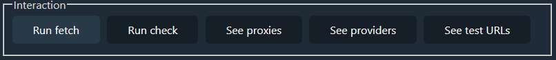

# Proxy server aggregator assignment

## Overview


The backend is written in Go. There is no separate HTTP server like Apache httpd
or Nginx. The Go framework that is used to expose a RESTful API registers the go
program as the HTTP listener. Besides the various RESTful endpoints, a static
HTML file is served under the `/` route. It contains some JavaScript that sends
HTTP requests to the backend via the asynchronous `fetch` API. The backend
stores its data in a PostgreSQL database.

## Running the application

The easiest way to run the application is starting it via `docker-compose up`.
This requires that docker and docker-compose is installed on the system. When
running this command the first time, it could be that it doesn't work because
the bootstrapping of the PostgreSQL database might not be finished when the
application tries to connect to it. Letting the bootstrap run through and then
stopping the docker-compose program and re-executing the same command should
work. This command

- creates a container running PostgreSQL
- creates a container running pgAdmin (this is very helpful during debugging)
- creates a container running the application

To develop/test the application it is advised to run
`docker-compose up postgres` to start only the postgres container from the
docker-compose file. Then the application should be able to connect to it
automatically and the code can be run and tested as one likes.

If it is desired to run the application with a PostgreSQL instance other than
via Docker, it is necessary to set some environment variables so that the
application knows how to connect to the database. This can be looked up in the
main.go file.

Whichever way to start the application is used, it can then be reached under the address http://127.0.0.1

## Terminology

In this document there are some terms that have a specific meaning in the
context of this project:

- _fetch_ - the act of retrieving a list of proxies from one or more providers
- _check_ - the testing of whether a URL can be reached by a request through
  a proxy
- _(web) service_ and _application_ - will be used interchangeably in this
  document to refer to the software that is developed in the course of this
  project
- _proxy_ - synonymous with proxy server and also sometimes refers to the
  address of a proxy server
- _provider_ - a web service or website that provides an HTTP API to retrieve a
  list of proxy servers

## Backend

The backend is split into two major parts.

1. __backend.go__ contains all the application logic. It has functions to

    - fetch lists of proxies from known web services which provide HTTP APIs to
      retrieve such lists
    - store the proxies uncovered by those providers in the database
    - check if certain test URLs can be reached via one or all proxy addresses
    - store the result of the check and some additional metadata about the
      checks in the database
    - in accordance with the requirements, the service must be able to display
      certain information about the fetch and check runs and certain metadata
      about them. There are functions in the file to assemble that data.

2. __restapi.go__ contains for every endpoint exposed by the REST API a function
   that is called when the endpoint is hit. These functions perform little logic
   themselves but rather call functions in backend.go that implement the
   behavior. One can think of this file as an implementation of the adapter
   design pattern adapting the interface (as in a set of functions) provided by
   backend.go to a RESTful HTTP interface.

## Providers

To the application a proxy list provider is just a URL. The backend will send a
GET request to the URL and expects the response to be formatted as a plain list
of `<IP>:<port>` pairs delimited by CRLF-bytes (`\r\n`) or just a new-line byte
(`\n`).

The service exposes a very simple API to manage the providers it knows. The
route is "/providers". A GET request to this route will be answered with a
JSON-formatted list of the currently known provider URLs. In the body of a PUT
request to this endpoint the user can provide a list of provider URLs. The list
of known providers that the backend keeps will be completely replaced by this
user-provided list.

This API design (PUT method) was chosen because the list of providers was
thought of as a resource. While the correct method to retrieve the resource is
obviously GET there is an argument to be made whether POST should be used
instead of PUT. The author's understanding is that for idiomatic REST APIs POST
is meant for requests that _create_ a resource or _invoke_ an operation. In this
case the providers resource is _replaced_ by the body content of the request.
This calls for PUT as the HTTP method. See 
https://restfulapi.net/rest-put-vs-post/

## Database & Schema

PostgreSQL is used for data storage. PostgreSQL (hereafter referred to as
Postgres) is a relational database management system. The code connects to it by
means of a library which implements the Postgres wire protocol.

In a real software project, a diligent software developer would use the third
normal form to design the database schema. In a real software project it would
be necessary to think early about certain aspects:

- If the service becomes popular, the system must later be adaptable to deal
  with a request frequency orders of magnitudes larger than at the beginning.
- Requirements could change, features might need to be added.

None of these are concerns with this project. The requirements are static. The
service will not go live. Therefore trade-offs can be made, shortcuts can be
taken, where lower engineering standards, deliberately chosen, can lead to
faster results. The first shortcut taken in this project is a simplified schema.
The following image shows the schema that might be chosen if engineering quality
was a bigger concern. In that case the schema would have adhered at least to the
third normal form and might therefore look similiar to this one:


With this schema every single required piece of information can be retrieved by
medium-sophisticated SQL queries.

For the proxies table it is arguable how to represent the port address. On the
one extreme it could be argued that it is acceptable to keep the address as a
string of the form 1.2.3.4:5678, since it will always be used like this and the
individual parts are likely never going to be looked at in isolation. On the
other extreme it could be argued that the most idiomatic form of adhering to
normalization rules would be to split the IP address up into four 8-bit integer
values in order to achieve atomicity.

It's interesting to note that this normalized schema looks a lot like a
dimensional schema that would be found in a data warehouse. *fetch_found* and
*check_results* are basically fact tables and the other tables dimension tables.
The only difference being that if one would follow the Kimball school of
dimensional design, time would be a separate dimension.

The schema used in the author's implementation is much simpler and looks like
the following:

```sql
CREATE TABLE IF NOT EXISTS fetch_runs (
    provider_url TEXT,
    proxy TEXT,
    ts TIMESTAMP
);
CREATE TABLE IF NOT EXISTS checks (
    proxy TEXT,
    test_url TEXT,
    check_start TIMESTAMP NOT NULL,
    this_proxy_check_start TIMESTAMP NOT NULL,
    success BOOLEAN NOT NULL,
    status_code INTEGER,
    error_msg TEXT
);
```

This is clearly inferior to the normalized schema discussed above. It results in
much more data redundancy and storage space inefficiency. But it immensely
simplifies the application code. Following the paradigm of simplicity here goes
so far that there are no foreign keys or even primary keys defined. This avoids
any potential complications that might arise from referential integrity
constraints. There are also no indexes. In a scenario where query speed is a
concern the author would analyze critical queries and add indexes on columns
that appear in `WHERE` clauses.

Another significant reason for why the schema can be this simple is the fact
that the tables will be used in an append-only fashion. One of the advantages of
and reasons for applying normalization is that the risk of introducing data
inconsistencies during updates is reduced. That is not a concern in this
application

The more complex SQL queries that are run against the database are the queries
that retrieve the data for the various detail lists that the is required to be
able to show. They show how most of the required information can be retrieved
from the schema shown above.

```sql
-- query to receive proxy details
with check_stats as (
    select
        proxy,
        max(this_proxy_check_start) as last_success
    from checks
    where success = true
    group by proxy
),
fetch_stats as (
    select
        proxy,
        max(ts) as last_seen,
        min(ts) as first_seen
    from fetch_runs
    group by proxy
)
select
    c.proxy as proxy,
    c.last_success as last_success,
    f.last_seen as last_seen,
    f.first_seen as first_seen
from check_stats as c
join fetch_stats as f
on c.proxy = f.proxy

-- query to retrieve details for a given provider ($1)
with count_by_run as (
    select
        provider_url,
		ts,
        max(ts) over (partition by provider_url) as latest_fetch,
        count(*) as found
    from fetch_runs
    group by provider_url, ts
)
select
    provider_url,
    latest_fetch,
    found
from count_by_run
where latest_fetch = ts and provider_url = $1

-- query to retrieve details for a given test URL ($1)
with pre as (
    select
        test_url,
        proxy,
        success,
        this_proxy_check_start,
	    check_start,
        max(check_start) over (partition by test_url) as most_recent_run
    from checks
)
select
    test_url,
    proxy,
    this_proxy_check_start as last_success,
    check_start = most_recent_run AS is_most_recent_run
from pre
where success is true
    and test_url = $1
order by this_proxy_check_start desc
limit 1
```

## Frontend

The frontend is a single HTML file with embedded JavaScript. For visual
enhancement https://github.com/kognise/water.css is used as a stylesheet.

The page consists of a top bar containing buttons. These are the primary
interactive elements of the web page. After first visiting the page this top bar
is all that is visible.



Clicking on "Run fetch" invokes the backend to fetch proxy lists from the
currently known providers immediately. "Run check" invokes the testing of all
currently known proxy addresses to see if the currently given test URLs can be
reached through each proxy. This process takes very long and is there fore run
in the background.

Clicking on "See proxies" reveals a table displaying all currently known-to-work
proxies and some details about them.


Clicking on "See providers" reveals a table displaying all currently known
providers as well as a timestamp when the providers was last fetched from and
how many proxies were returned during that fetch.


Clicking on "See test URLs" reveals a table displaying all currently know test
URLs as well as the proxider that was most recently found to be able to connect
to the URL.


## REST API

- Endpoint `GET /`
    - Response `200 OK`
    - Body contains the index.html file of the project
- Endpoint `POST /clear`
    - This truncates all DB tables
    - Takes no query parameters or body content
    - Response `204 No Content` in case of success and empty body
    - Response `500 Internal Server Error` in case something went wrong with a
      short error message in the body
- Endpoint `POST /fetch`
    - This triggers the retrieval of proxy lists from all currently known
      providers
    - Takes no query parameters or body content
    - Response `204 No Content`
    - No response body
- Endpoint `POST /check`
    - This triggers the checking of all currently known proxy addresses
    - Accepts an optional integer query parameter 'limit' **
        - Example: `POST /check?limit=20`
        - Scanning is stopped after _limit_ tested proxies
    - Response `202 Accepted` in case of success. 202 was chosen here because
      the check will be run asynchronously in the background. So although a
      response is sent right away the processing of it is actually not finished
      at that moment.
    - No response body
- Endpoint `GET /proxies`
    - Takes no query parameters or body content
    - Response `204 No Content` in case of success
        - Body contains a JSON encoded list of proxies and some further
          information about them, for an example see below
    - Response `500 Internal Server Error` in case something went wrong
        - Body contains short error message
- Endpoint `GET /providers`
    - Takes no query parameters or body content
    - Response `200 OK` in case of success
        - Body contains a JSON encoded list of provider URLs plus some
          additional info for each
    - Response `500 Internal Server Error` in case something went wrong
      the request body
        - Body contains short error message
- Endpoint `PUT /providers`
    - Overwrite the internally kept list of providers with those provided in the
      request body
    - Response `204 No Content` in case of success
        - Body is empty
    - Response `400 Bad Request` in case something is wrong with the content of
      the body
        - Body contains short error message
- Endpoint `GET /testurls`
    - Takes no query parameters or body content
    - Response `200 OK` in case of success
        - Body contains a JSON encoded list of test URLs plus some
          additional info for each
    - Response `500 Internal Server Error` in case something went wrong
      the request body
        - Body contains short error message
- Endpoint `PUT /providers`
    - Overwrite the internally kept list of test URLs with those provided in the
      request body
    - Response `204 No Content` in case of success
        - Body is empty
    - Response `400 Bad Request` in case something is wrong with the content of
      the body
        - Body contains short error message
- All other endpoints will be rejected with either _404 Not Found_ or 
  _405 Method Not Allowed_.

** By instinct, it might feel unintuitive that a POST request has a query
string. That is normal for GET requests but not for POST requests. "Parameters"
of POST requests are conventionally submitted as the body. The decision of
designing the limit parameter as a query string is about semantics. The body of
a POST request is usually the new entity in a request with creation semantics.
The semantics of this limit parameter, however, is more of a narrowing of scope
for a request with operation invoking semantics. Therefore this design has been
chosen.

Example response for `GET /proxies` (reponse truncated for brevity):
```
HTTP/1.1 200 OK
Content-Type: application/json; charset=utf-8
Date: Sun, 21 Jun 2020 20:19:05 GMT
Transfer-Encoding: chunked

[{"Proxy":"163.172.120.214:5836","LastSuccess":"2020-06-21T16:32:07.232849Z","LastSeen":"2020-06-21T22:01:19.008399Z","FirstSeen":"2020-06-21T16:03:22.510264Z"},{"Proxy":"71.183.100.76:42413","LastSuccess":"2020-06-21T16:11:24.38764Z","LastSeen":"2020-06-21T22:01:19.009399Z","FirstSeen":"2020-06-21T16:03:22.510264Z"},{"Proxy":"195.191.25.62:5836","LastSuccess":"2020-06-21T16:32:28.310699Z","LastSeen":"2020-06-21T22:01:17.740222Z","FirstSeen":"2020-06-21T16:03:22.510264Z"},{"Proxy":"114.31.15.62:8080","LastSuccess":"2020-06-21T16:32:54.395024Z","LastSeen":"2020-06-21T22:01:19.008399Z","FirstSeen":"2020-06-21T16:11:13.02318Z"},{"Proxy":"146.83.180.25:3128","LastSuccess":"2020-06-21T16:32:58.406223Z",
```

Example response for `GET /providers`:
```
HTTP/1.1 200 OK
Content-Type: application/json; charset=utf-8
Date: Sun, 21 Jun 2020 20:22:10 GMT
Content-Length: 331

[{"Provider":"https://www.proxy-list.download/api/v1/get?type=http","LastFetch":"2020-06-21T22:01:17.740222Z"},{"Provider":"https://motherfuckingwebsite.com/","LastFetch":"2020-06-21T22:00:09.571038Z"},{"Provider":"https://api.proxyscrape.com/?request=displayproxies\u0026proxytype=http","LastFetch":"2020-06-21T22:01:19.009399Z"}]%
```

Example request for `PUT /providers`:
```
PUT /providers HTTP/1.1
Host: localhost:5000
User-Agent: curl/7.58.0
Accept: */*
Content-Type: application/json
Content-Length: 56

["https://motherfuckingwebsite.com/", "http://txti.es/"]
```

Example response for `GET /testurls`:
```
HTTP/1.1 200 OK
Content-Type: application/json; charset=utf-8
Date: Sun, 28 Jun 2020 06:18:16 GMT
Content-Length: 146

[{"TestURL":"https://motherfuckingwebsite.com/","Proxy":"203.110.164.139:52144","Timestamp":"2020-06-28T18:29:35.143747Z","IsMostRecentRun":true}]
```
